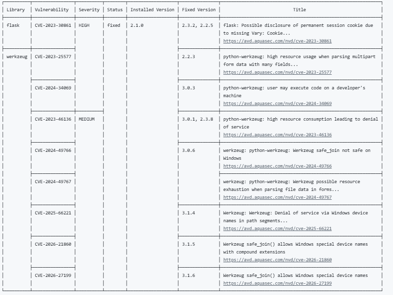

# DevSecOps Project — RifedOthman

> Pipeline CI/CD sécurisé avec GitHub Actions · Trivy · Conftest · Hadolint

---

## Structure du projet

```
├── app.py                     # API Flask (Python)
├── Dockerfile                 # Image Docker
├── requirements.txt           # Dépendances Python
├── k8s-deployment.yaml        # Manifeste Kubernetes
├── policy/deny_root.rego      # Règle Conftest (refus root)
└── .github/workflows/ci.yml   # Pipeline GitHub Actions
```

---

## Pipeline CI/CD

Le workflow se déclenche à chaque `push` sur `main` et enchaîne 6 jobs :

```
Lint YAML & Dockerfile
    ├──→ Build Docker Image
    │        ├──→ Trivy — Filesystem Scan
    │        └──→ Trivy — Docker Image Scan
    └──→ Conftest — Kubernetes Policy
                       └──→ Pipeline Summary
```

| Job | Outil | Rôle |
|-----|-------|------|
| Lint | yamllint + Hadolint | Vérifie la syntaxe YAML et Dockerfile |
| Build | Docker | Construit et archive l'image |
| Trivy FS | Trivy (`scan-type: fs`) | Scanne les dépendances Python (`requirements.txt`) |
| Trivy Image | Trivy (`scan-type: image`) | Scanne les CVE dans l'image Docker |
| Conftest | OPA / Rego | Vérifie que le pod ne tourne pas en root |
| Summary | GitHub Step Summary | Tableau de bord des résultats dans Actions |

---

## Règles de sécurité mises en place

### Conftest — Refus des pods root (`policy/deny_root.rego`)

Refuse tout manifeste Kubernetes dont un container aurait `runAsUser: 0`.  
Le manifeste `k8s-deployment.yaml` utilise `runAsUser: 1000` → la règle **passe** ✅.

### Hadolint — Lint du Dockerfile

Correction appliquée : ajout de `--no-cache-dir` sur `pip install` (règle **DL3042**).

### yamllint — Validation YAML

Vérifie la syntaxe du manifeste Kubernetes avant tout build ou déploiement.

---

## Vulnérabilités détectées

### Dépendances Python — Trivy FS

| Bibliothèque | Version | CVE | Sévérité | Description |
|---|---|---|---|---|
| Werkzeug | 2.1.0 | CVE-2023-25577 | **HIGH** | DoS via requête multipart malformée |
| Werkzeug | 2.1.0 | CVE-2023-46136 | **HIGH** | DoS via parsing multipart non borné |

### Image Docker — Trivy Image

L'image de base `python:3.9` (Debian complet) embarque des paquets système vulnérables :

| Composant | CVE exemple | Sévérité |
|---|---|---|
| OpenSSL | CVE-2023-0286 | HIGH |
| glibc | CVE-2023-4911 | HIGH |
| libcurl | CVE-2023-38545 | MEDIUM |

> Les scans sont configurés en mode **non bloquant** (`exit-code: 0`) pour permettre la livraison continue tout en documentant les risques.
 
---
## Captures de résultats




## Analyse de risques

| Risque | Niveau | Mesure corrective |
|---|---|---|
| Werkzeug 2.1.0 (CVEs DoS) | **CRITIQUE** | Mettre à jour vers `werkzeug>=3.0.1` |
| Image `python:3.9` volumineuse | **CRITIQUE** | Passer à `python:3.9-slim` |
| Tag `image: flask-app:latest` | MOYEN | Utiliser un tag SHA précis |
| Pas de `resources.limits` dans le pod | MOYEN | Ajouter des limites CPU/mémoire |
| Scans Trivy non bloquants | FAIBLE | Passer `exit-code: 1` en production |

---

## Résultats du pipeline

> Captures disponibles dans l'onglet **Actions** du dépôt GitHub.

- **Lint YAML & Dockerfile** — passe après correction DL3042 ✅  
- **Build Docker Image** — image buildée et archivée comme artifact ✅  
- **Trivy — Filesystem Scan** — CVEs HIGH détectées dans Werkzeug (non bloquant) ✅  
- **Trivy — Docker Image Scan** — CVEs OS détectées dans `python:3.9` (non bloquant) ✅  
- **Conftest — Kubernetes Policy** — règle root respectée (`runAsUser: 1000`) ✅  
- **Pipeline Summary** — tableau de synthèse généré dans GitHub Actions ✅  

---

## Réflexion sécurité

L'approche **"Shift Left"** intègre les contrôles de sécurité au plus tôt dans le cycle de développement, avant tout déploiement. Les bénéfices observés :

- Détection automatique des vulnérabilités à chaque commit
- Politiques de sécurité codifiées et vérifiables (Rego / Conftest)
- Traçabilité complète des résultats dans GitHub Actions

---

*TP DevSecOps *
